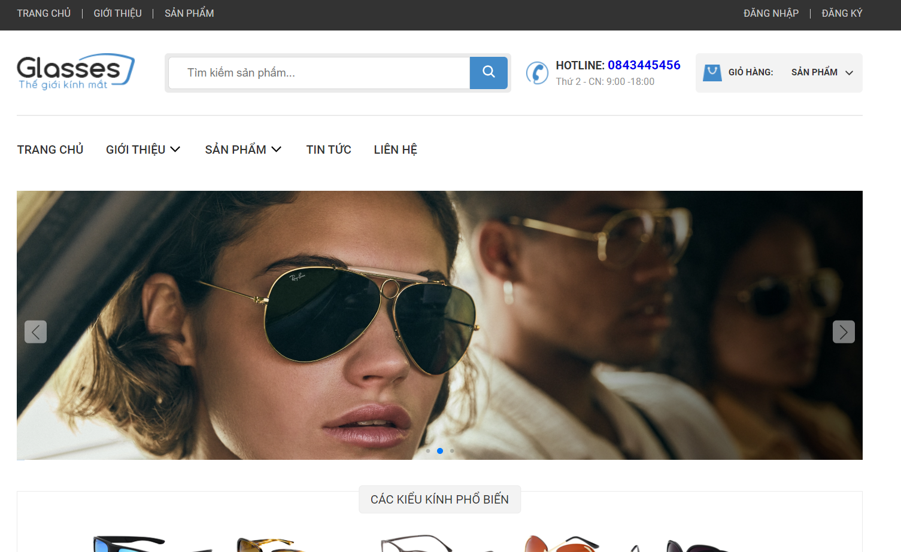

# Project Introduction:

This project is a responsive e-commerce website designed for selling glasses. The website includes a detailed product view, as well as a list of products categorized by type, including hot, sale, and new items. The website was developed using HTML, CSS, and JavaScript.

## IMAGE DEMO WEBSITE:

#### Giao diện chính của trang web trên thiết bị pc,laptop

#### Giao diện chính của trang web trên thiết bị mobile

### DEMO WEBSITE:

## LINK DEMO WEBSITE:

A demo of the website can be found at the following link: https://glasses-git-main-cuonggosu.vercel.app/

## Technologies in use:

This project was developed using the following technologies:

- HTML
- CSS
- JavaScript
- Swiperjs
- Leaflet

## FEATURE:

#### The website includes the following features:

- The website also supports rendering products from a RESTful API (https://glasses-67sp43rtm-cuonggosu.vercel.app/db.json)
- Responsive design to ensure optimal display on different devices
- Detailed product view for each item
- Categorization of products into different groups based on their status, including hot, sale, and new items
- Display features(sort,grid,type,...) products
- SignIn, SignUp with firebase (Authentication)
- CRUD cart with firestore

## Installation:

To install this project, simply clone the GitHub repository:

git clone https://github.com/CuongGosu/BookStore.git
